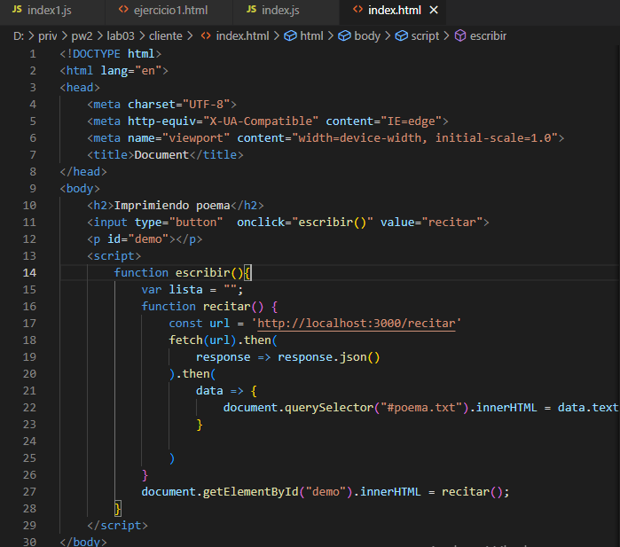

<table>
    <theader>
        <tr>
            <td></td>
            <th>
                UNIVERSIDAD NACIONAL DE SAN AGUSTIN 
                FACULTAD DE INGENIERÍA DE PRODUCCIÓN Y SERVICIOS 
                ESCUELA PROFESIONAL DE INGENIERÍA DE SISTEMAS
            </th>
            <td></td>
        </tr>
    </theader>
    <tbody>
        <tr><td colspan="3">Formato: Guía de Práctica de Laboratorio / Talleres / Centros de Simulación</td></tr>
        <tr><td>Aprobación:  2022/03/01</td><td>Código: GUIA-PRLD-001</td><td>Página: 1</td></tr>
    </tbody>
</table>

GUÍA DE LABORATORIO 

<table>
<theader>
<tr><th colspan="6">INFORMACIÓN BÁSICA</th></tr>
</theader>
<tbody>
<tr><td>ASIGNATURA:</td><td colspan="5">Programación Web 2</td></tr>
<tr><td>TÍTULO DE LA PRÁCTICA:</td><td colspan="5">Ajax y NodeJS</td></tr>
<tr>
<td>NÚMERO DE PRÁCTICA:</td><td>03</td><td>AÑO LECTIVO:</td><td>2022 A</td><td>NRO. SEMESTRE:</td><td>III</td>
</tr>
<tr>
<td>FECHA PRESENTACION::</td><td>9-mayo-2022</td><td>HORA DE PRESENTACION:</td><td>16-mayo-2022</td><td></td><td></td>
</tr>
<tr>
<td>INTEGRANTES::</td><td>
<ul>
<li>Suasaca Pacompia Alvaro Gustavo</li>

</ul>
<td>NOTA</td><td></td><td></td><td></td>
</td>
</tr>
<tr><td colspan="6">DOCENTES:
<ul>
<li>Richart Smith Escobedo Quispe (rescobedoq@unsa.edu.pe)</li>
</ul>
</td>
</<tr>
</tdbody>
</table>

# SOLUCION Y RESULTADOS

## I. SOLUCION DE EJERCICIOS/PROBLEMAS

- Intento del  problema del poema

- Solucion del Ejercicio 1 :
  https://github.com/alvaro865/Pweb2_lab_03
  - Ejercicio 1
  
  - 
  - Aqui para devolver el texto del poema llame a otra funcion para que se pueda cambiar con el parrafo dentro del body
  
  

## II. SOLUCION DEL CUESTIONARIO

 - En el Ejemplo "Hola Mundo" con NodeJS. ¿Qué pasó con la línea: "Content type ….."?
    No fue necesario pues el contenido que enviamos solo es para verificar si contesta el servidor adecuadamente y en los demas ejercicios se usa express 
    para poder especificar si es una solicitud POST o GET.
    
 - ¿En los ejercicios. ¿En qué lugar debería estar el archivo poema.txt? 
    En el ejercicio realizado lo colocamos dentro de la carpeta priv, no habria problema pues podemos especificar en que carpeta se encuentra.
    
 - ¿Entiende la expresión regular en el código y se da cuenta de para qué es útil?
    No pude entenderlo enteramente pero cre que se refiere al uso de fetch pues con este se puede manipular parte de los canales HTTP, peticiones y respuestas,
    segun la API fetch es una mejor forma que XMLHttpRequest pues es una mejor alternativa que puede ser empleada por otras tecnologias.
    
 - Note que la respuesta del servidor está en formato JSON, ¿Habrá alguna forma de verla directamente?
   Se puede realizar con queryselector ya que esta devuelve el primer elemento del documento especificado
   

## III. CONCLUSIONES
 - Trate de resolver primero el problema del poema pero no pude ejecutarlo como se debia pues al implementarlo me salia indefinido me falto el poder imprimirlo 
   en la pagina web, pues cada ves que lo mando a ver en la consola el poema aparece con el cambio del salto de linea por el de  , de la misma manera con los
   otros ejercicios.
 - Aun se me hace complicado realizar las funciones en flecha y como cuando ves opciones de realizar de otra manera el codigo pues no siempre se adecua a lo que 
   uno quiere lograr.

